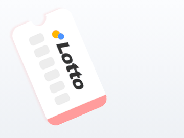
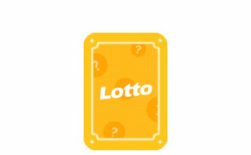

# AI UI Motion Lab

AI로 제작한 모션을 모아두는 실험실입니다. Lottie JSON과 브라우저 미리보기를 함께 정리합니다.

## Motions

| Motion | Description | Preview | Lottie JSON |
|---|---|---|---|
| 로또 머신 Lottie | 로또 추첨기 구조와 공 움직임을 실험한 모션 |  | `lotto-machine/lottery-machine.json` |
| 물방울형 폭죽 Lottie | 중심에서 핑크 톤 물방울 파편이 퍼지는 폭죽 모션 |  | `droplet-firework/droplet-firework.json` |
| 로또 응모권 장수별 Lottie | 1장부터 7장까지 중앙 정렬과 그림자 타이밍을 맞춘 응모권 모션 |  | `lotto-ticket-count/lotto-1.json` ~ `lotto-ticket-count/lotto-7.json` |
| 로또 카드 수평 펼침 Lottie | 노란 로또 카드 5장이 수평으로 촥 펼쳐지는 모션 |  | `lotto-card-fan/horizontal-5.json` |
